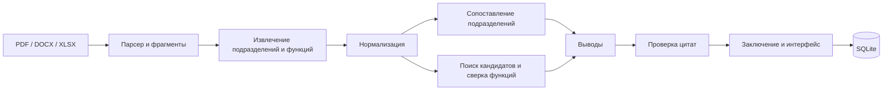

# Vivalet — AI Organization Auditor

Прототип для сопоставления организационной структуры и функций подразделений до и после реорганизации. Интерфейс и выводы на русском языке.

## Problem

Положения, организационные схемы и инструкции приходится сравнивать вручную. При этом трудно проследить, какая функция переместилась, исчезла из нового документа или оказалась закреплена за несколькими подразделениями.

## Solution

Приложение принимает документы «до» и «после», извлекает текст с указанием местоположения, строит список подразделений и функций, сопоставляет их и показывает возможные изменения с цитатами. Выводы о потерях, дублировании и конфликте интересов являются гипотезами для проверки сотрудником.

## Features

- Загрузка нескольких PDF, DOCX и XLSX в каждую сторону сравнения.
- Сохранение анализов и распознанных фрагментов в SQLite.
- Сопоставление подразделений, функций и потенциальных потерь.
- Поиск возможного дублирования и конфликта функций исполнения и контроля.
- Проверка каждого вывода на наличие точной цитаты в исходном фрагменте.
- Панель источника с разделом, страницей, абзацем или строкой.
- Экспорт результата в JSON и Markdown.
- Демо на документах редакций №8 и №9 из `testdocs/`.

## Architecture



## AI Pipeline

Если задан `OPENAI_API_KEY`, приложение использует Responses API со строгой JSON-схемой для извлечения сущностей, embeddings для поиска похожих функций, отдельные запросы для смысловой проверки и генерации итогового заключения. Документы передаются модели как недоверенные данные. Текст функции всегда хранится и цитируется в исходном виде. Кандидаты без точной цитаты отсеиваются.

Без ключа работает **явно обозначенный режим правил**: извлечение по структуре текста и сопоставление по действиям и словам. Он нужен для локального запуска и демонстрации без внешнего API; его выводы требуют более тщательной проверки. Демо никогда не подменяется готовым JSON.

## Tech Stack

Next.js 16, React 19, TypeScript, Prisma 6, SQLite, OpenAI SDK, Mammoth, pdf-parse, SheetJS, Vitest.

## Project structure

- `src/app/` — страницы и HTTP-маршруты.
- `src/components/AnalysisView.tsx` — экран результатов и панель источника.
- `src/lib/documents.ts` — парсеры и привязка цитат.
- `src/lib/analysis/` — извлечение, сопоставление, проверка доказательств и pipeline.
- `src/lib/ai/` — клиент, схемы ответов и инструкции модели.
- `prisma/schema.prisma` — схема хранения.
- `tests/` — проверки ключевых правил.
- `testdocs/` — предоставленные документы для демо.

## Prerequisites

Node.js 20.9+ и npm. Для AI-режима нужен ключ OpenAI и сетевой доступ.

## Installation

```bash
npm install
```

При первом `npm run dev` или `npm run build` скрипт создаёт `.env` из примера и инициализирует SQLite через Prisma. Для AI-режима добавьте ключ в `.env`.

## Environment variables

```env
DATABASE_URL="file:./dev.db"
OPENAI_API_KEY=""
OPENAI_MODEL="gpt-4.1-mini"
OPENAI_EMBEDDING_MODEL="text-embedding-3-small"
```

Ключ используется только на сервере. `.env` и локальная база исключены из Git.

## Database setup

Обычно выполняется автоматически. Для ручного обновления схемы:

```bash
npm run db:push
```

## Run locally

```bash
npm run dev
```

Откройте `http://localhost:3000`. Для production-сборки: `npm run build` и `npm start`.

## Demo scenario

Нажмите **«Запустить демо»**. Приложение загрузит редакцию №8 как «до», редакцию №9 как «после» и запустит тот же pipeline, что используется для пользовательских файлов. Вкладки результата показывают обзор, структуру, функции, выводы и заключение. Нажмите на ссылку источника, чтобы увидеть точный фрагмент.

## How analysis works

1. Парсеры переводят документ в фрагменты с местоположением.
2. Извлекаются подразделения и функции. Нормализованный текст нужен только для поиска соответствий.
3. Подразделения сопоставляются по названиям и функциям.
4. Для функций ищутся кандидаты. В AI-режиме используются embeddings и отдельная смысловая проверка.
5. Формируются гипотезы о потерях, перемещениях, изменениях, пересечениях и конфликте интересов.
6. Валидатор проверяет ссылки на документы, существование фрагмента и точное вхождение цитаты.
7. Только проверенные выводы попадают в основной результат; остальные записываются в `needsReview`.

## Explainability / source traceability

Каждый вывод содержит причину, оценку уверенности и ссылки на фрагменты. Для потенциальной потери обязательна цитата «до»; для дублирования и конфликта — цитаты обеих функций. Отсутствие явного соответствия после реорганизации не доказывает фактическую утрату функции.

## Limitations

- PDF без текстового слоя не распознаётся; OCR не включён.
- Режим правил опирается на формулировки документа и может пропустить синонимы или неверно распределить функции между подразделениями.
- Очень большие документы требуют больше запросов к модели и могут обрабатываться дольше; синхронный HTTP-запуск рассчитан на демонстрационные комплекты.
- Локальный прототип не имеет авторизации; не размещайте его публично с конфиденциальными документами.

## Security notes

Загруженный текст считается недоверенным. Инструкции из документа не исполняются. API-ключ не передаётся в браузер. Размер одного файла ограничен 20 МБ.

## Future development

OCR, более точное извлечение иерархии и ролей, пакетная обработка больших документов, доступ по ролям и сравнение с предоставленными нормативными требованиями.

## Verification

```bash
npm run lint
npm test
npm run build
```
